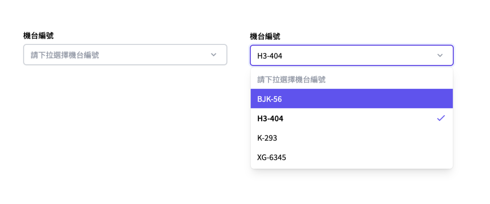

# Select<svg xmlns="http://www.w3.org/2000/svg" width="1em" height="1em" viewBox="0 0 32 32" style="vertical-align: text-bottom;padding-left: 8px;color: #aaa;"><path fill="currentColor" d="M5 5v4h1v14H5v4h4v-1h14v1h4v-4h-1V9h1V5h-4v1H9V5zm4 3h14v1h1v14h-1v1H9v-1H8V9h1zm1 2v8h4v4h8v-8h-4v-4zm2 2h4v4h-4zm6 4h2v4h-4v-2h2z"/></svg>



## 簡介

`Select` 元件提供了一個下拉選單，讓使用者可以在多個選項中選擇一個。常常被使用在表單中

## VSCode Snippet

```
jinput:select
```

## 元件程式碼

```javascript
<script setup>
  import { ref } from 'vue'
  import Select from './UI/Form/Select.vue'
  import Select from './UI/Form/Select.vue'

  const selectData = ref(null)
  const selectOptions = ref([
    {
      label: '選項標題',
      value: 選項值,
    },
    //...等
  ])
</script>

<InputField
  for="select"
  label="輸入框標題"
  :valid="前端驗證結果(Boolean)"
  :errorMsg="前端格式驗證錯誤結果提示"
  :helperMsg="輸入輔助提示"
  required
>
  <Select
    :options="selectOptions"
    :optionLabel="selectData?.label"
    v-model="selectData"
    placeholder="placeholder提示文字"
  ></Select>
</InputField>
```

## 元件 Props

| Prop Name    | type   | 預設         | 說明                                                                            | required |
| :----------- | :----- | :----------- | :------------------------------------------------------------------------------ | :------- |
| options      | any[]  | Null         | 下拉選單資料，物件陣列，資料設定規則如下 [ {label: ‘選項標題’,value: 選項值},…] | true     |
| option label | String | Null         | 取得當前選項標題                                                                | true     |
| modelValue   | any    | Null         |                                                                                 | true     |
| placeholder  | String | "請下拉選擇" | 設定選單提示文字                                                                | false    |
